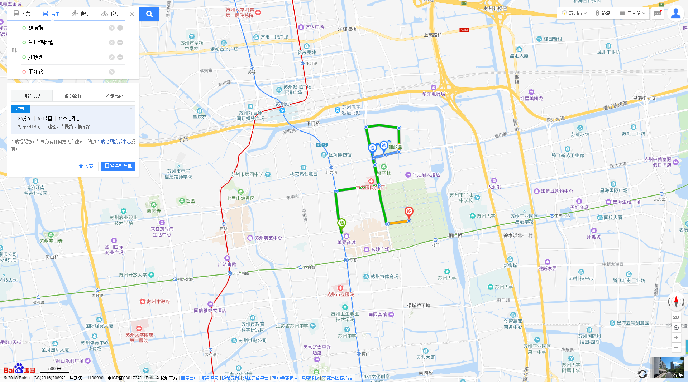
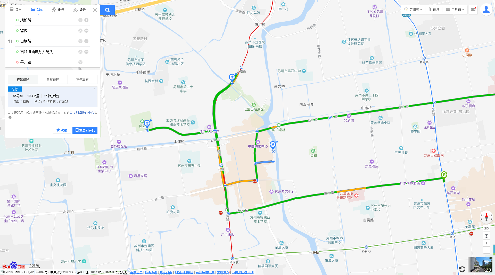
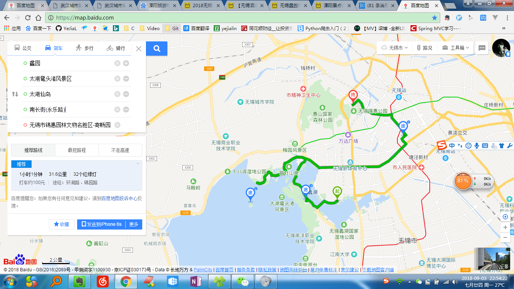

# 苏州

## 苏州

- [ ] Day1 苏州博物馆—拙政园—平江路—观前街
* 拙政园 狮子林
地址：苏州市姑苏区东北街178号
时间：7:30-17:30
门票价格：淡季(10月31日-3月31日，6月)70元，旺季(4月-5月，7-10月)90元
用时约：2h)
时间：星期二-日 9:00-17:00
用时约：2h
门票：免费， 苏博的官网可以预约参观时间！！`一定要提前预约`
* 平江路
用时约：2h
门票：无
桃花源记...
* 观前街
用时约：

``` text
tips: 比较出名的沧浪亭、狮子林、拙政园和留园分别代表着宋（公元960～1276年），元（公元1271～1368年），明（公元1368～1644年），清（公元1644～1911年）四个朝代的艺术风格，被称为苏州“四大名园”。
```




- [ ] Day2 诚品书店—金鸡湖
* 成品书店
用时约：半天+周边
门票：免费


- [ ] Day3 苏州大学?—留园—山塘街—古运河游船 add  虎丘
* 苏大  耦园？
用时约：待定
门票：免费
> 再以及：如果真的有紧急的、临时的、没有预约的朋友想进苏大，真的不要从相门地铁站旁边的苏大北门试图进。真的是没有用的（手动摊手）。悄悄告诉你们地图搜索： 苏州大学医院（莫邪路、庄先湾路交叉口处小门）& 苏州大学东校区南门（葑门路工商银行旁小巷），祝你们好运~
* 留园
用时约：
门票：
* 七里山塘（晚上）
用时约：2h


* 寒山寺
用时约：
门票：

* 虎丘
用时约：
门票：


## 无锡

* 锡惠公园
* 无锡市锡惠园林文物名胜区-寄畅园
* 南长街
---


* 蠡园 
* 太湖鼋头渚风景区
* 太湖仙岛
---
* 雪浪山薰衣草园




